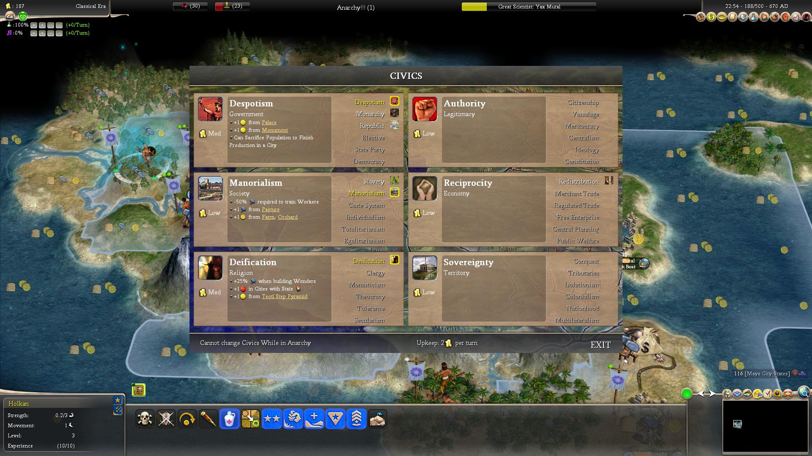
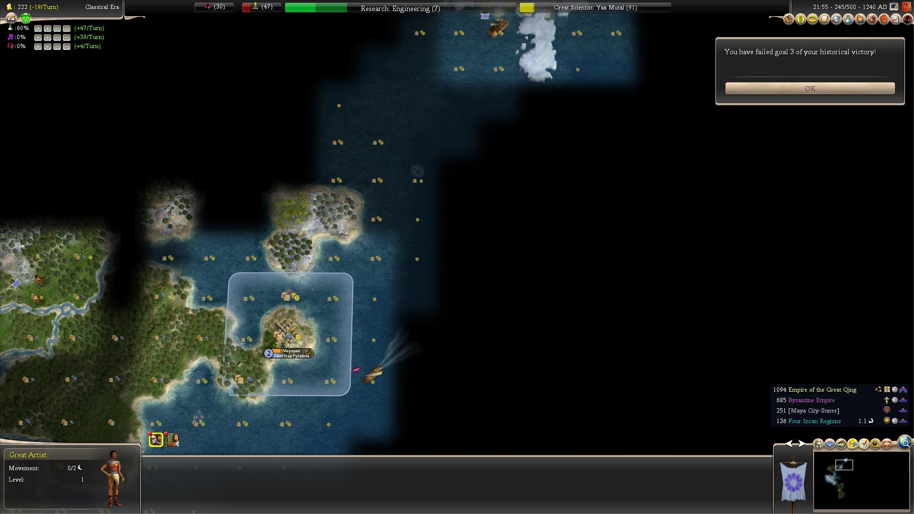

# DoC 1.15 玛雅UHV -Kroraimna
## 1.游戏情况简介
1. 难度paragon。
2. 速度normal。
3. 有S/L。

原帖地址：https://tieba.baidu.com/p/5798998586

## 2.玛雅UHV简介
### 玛雅三个历史任务：
1. 37回合内研究出数学，（六个科技，1007个瓶子）。
2. 67回合内造出奇琴伊察（另需三个科技723瓶子+405锤子。）
3. 在欧洲文明发现美洲前，先联系上欧洲文明。

## 3.战报内容

### UHV1

起始科技树：

玛雅UA：中世纪前科研花费减半。（减完之后，前六个科技要1007个瓶子。）

玛雅UB：Ball Court 代替竞技场。（科技太后面了，完全用不到。）

玛雅UU：Holkan掷矛手。获胜后可以给最近的城市加一些食物。（很有用。）

玛雅这玩意儿感觉有点超出我的能力范围。

所以还是与大家探讨。

第一个任务，37回合内要积累1007个烧瓶。

我觉得硬研究不可能。

得靠伟人。

所以都城选址，要有足够的粮食。

有人说左移一格坐玉米，为我所不取。

我选择走一步坐染料。

移动这一步不是贪图那一个螃蟹，早期我无法利用海洋资源。

坐染料的目的是把移民脚下的那块平原让出来，通过工人开发，拿到三个食物。

因为要出伟人，科技上得先出书写。造了图书馆，才来得及憋大科。

然而书写并不是数学的前置科技，这意味着在接下来的36回合内，要搞定七个科技了。

第二回合，都城坐下，自动获得两工人。

但这个时候我有一个失误：忘记点选要研究哪个科技了。

现在复盘发现，真是神奇的天意。

坐在石头上的城邦Danibaan起始有2弓1投矛。（实际是2弓2投矛，另一个投矛在北面看不见。）

我这局开的，对方的投矛第一回合结束的时候跨河攻击我在丛林里的holkan，死了。

这样石头城邦里就只有2小弓在守城。

坐城下来不选科技的结果是，先研究了construction一回合。

照道理这使得现在切书写，相当于浪费了一回合，出伟人更慢了。

可我当时没有发现这一点，也就没有读档。

第四回合（T148），西北方向的墨西哥那边冒出来一个小野城（未来砍二首都）。

这个小野城非常重要。

非常非常重要。

第五回合（T149），上手忘记点科技的蝴蝶效应出现了。

我们看上帝视角：

而下面这张图，是上手点书写的图：

两点关键区别：

1，左上美洲虎战士的位置决定了他们下一回合对石头城的攻击强度。只有前者才能让我捡漏。

2，下边小野刷出来的位置决定了我是否需要分兵回救老家。也是只有前者才能让我全力攻城。

而且我通过复盘发现，即使我不选择书写，就算主动选择研究一回合constructuion，也只会出现到图二的结果。只有忘记点选科技才会刷出图一。而这个操作，实在非人力所能为之的，只能说是阴差阳错的天意。

第六回合（T150），石头城两小弓残血，我来收割。

两holkan投矛击败两小弓，共给首都添加10粮食，下一回合就可以涨人口。

石头城已有2人口，为避免饥荒，正好趁混乱的两回合叫工人去指定地点开农场。

接下来的任务就是种田。

首都边造庙边涨人口。

石头城人口是停滞的，也先出个庙。将来这里要造奇琴伊察（库库尔坎），文化至少要升一级。

值得注意的是，小野会在三个红圈的位置随机刷出来。

我发现他们出生地的原则是城市周边一格不会刷出来，那么两座城市当中，也只有那两格可以刷。控制好他们的出生点，便于我仅有的两个holkan去防御。我暂时没有余力去造兵。

石头城接下来造个移民。

还剩23回合。第一个科技书写还没研究好。时间很紧张。

14回合后移民坐城。

他的任务是代替首都吃银矿，保证科研点数。

在这14回合期间，书写、渔船、建造研究完毕。首都人口涨到5，且已经在庙里养了一个专业人员。

还剩9回合，还差4个科技。

同一回合，首都杀1人加速图书馆。

次回合，养满3个专业人员。此时是T173，距离Deadline还有8回合。而诞生一个伟人，也正好需要8回合。

科技方面，Divination和Arithmetics加起来也正好是要8回合。由此可见出个移民保证银矿的产出是多么必要。

首都在杀出个图书馆后，靠溢出的锤子3回合出了个侦察兵。此人有大用。

石头城，则在出了移民后开建粮仓，为第一个历史任务完成后的涨人口做准备。

T180，还剩一回合的时候，伟人的诞生率是大仙57%，科学家43%。

T181，大科学家诞生。

其实早1到2回合杀人出图书馆可以提高大科学家的产生几率，回合数通过微操也够。

看科技树。Arithmetics刚研究完，还剩历法和数学这两个科技。而大科正好可以秒这两个科技。在科技树的下方，制作者有列每一种伟人的点亮优先级，对我们的研究安排很有帮助。

第一个历史任务完成。

### UHV2

继续。接下来的任务是在30回合内造出奇琴伊察。

530瓶子+405锤子。

看上去好像不是很难，但是一个我至今没搞清楚的事件使得这个任务变得无比困难。

那就是：到T205左右，奇琴伊察就突然不能继续建造了。

我试过几盘，有的还更早，类似于城市里传入了宗教所以不能再造神谕这种情形，但我的城市明明一直没有宗教，非常搞不懂。

如图：

没办法，只能逼自己要在T205之前造出来。

也就是说，从T181完成任务一开始，24回合冲奇迹。

先革命，转成共和政体，花钱买holkan。

兵贵神速。

三回合后，买了两个投矛holkan，再加上原来的两个holkan，全员直奔小野城。

这时候之前造的一个侦察兵发挥作用了，他和两个工人兄弟站住位置，如图，这样小野就刷不出来，我便不需要留兵镇守老家，可以倾全国之力去攻城了。

T187，四投矛打两弓箭。

死掉一个雇佣兵，收降一个工人。

家里的工人赶紧小野刷兵的间隙过来一同开发土地。目的就是让石头城尽快涨人口。

革命回Despotism，以后还是要杀人加速。

T195，两个前置科技研究完毕。

石头城开造奇迹。因为很早就造了粮仓，所以这个时候的人口也涨到一定规模。

现在我们一共四城。

新打下来的坎二城主要是出弓箭手，以防御北方的小野。

首都和南方城主要是渔船涨人口。

工人则开发石头城边上的土地，提高它的产能。

T203，石头城的产能推到极致，杀人出奇迹。

第二个历史任务完成。

黄金时代。

### UHV3

第三个历史任务，是要在欧洲文明发现美洲前，先联系上欧洲文明。

好好研读一下这句表述，还是很奥妙的。

make contact with a European civilization before they discover America

关键词一：America。美洲。包括南北美大陆和加勒比岛屿。

关键词二：make contact。怎么样算make contact？有几种方式make contact？

打完这一局我有了新的理解和发现。

抢在欧洲前面出cartography（制图学）科技，然后造caravel帆船横跨大西洋，是不可能的。

我的原始想法和前辈一样，去冰岛！

图中绿色叉叉为海沟，小船划不过去。

计划是带移民划到A点建城打通航路，然后去B点建第二座城，扩张文化后（必要的话用大艺术家炸），再打通去C的航路。

在C建第三座城，大艺术家炸开，看到对面英国。

因此，接下来的任务很明确：造两艘galley，三个移民，出两个大艺术家。

T220，公元990年，宋朝来了！

不久之后，从他们那里传入了瘟疫，很是影响了玛雅的发展。

当时稳定度降低，差点崩了。

T228，1070AD，第一个大艺术家在首都诞生。

第一批小船和移民也已就位了。

T240，1190AD，阿兹特克崛起！

我同意解放城市，却仍旧开启战争状态。

那我不客气了，派个小兵出征。天晓得他们城里只有三工人两移民，束手待毙。

我后来又尝试过不解放城市，也是战争，但更奇怪。

阿特兹克的大军会在北面高山的后面傻呆着，也不过来攻城，也不灭亡。明明他没有城了，却还能活着。

10回合后我还可以和他和谈。然后他的部队就会乱窜，帮我去抵挡北方的小野。

大概是个bug。

T243，1120AD，第二个大艺术家在石头城诞生。

同年，按原定计划，北美的第一座城建立。

先头的移民和大艺术家坐船直奔格陵兰。

然后就傻X了。

T245，1240AD，移民带着大艺术家登上格陵兰岛。

这才想起来：

冰原上不能坐城！！

傻X了。

祸不单行。

下一回合，拜占庭的帆船发现了我们的北美城市。

游戏失败了。

满盘皆输。

来自欧皇的嘲讽。

苦逼的玛雅人还能起死回生吗？

当然能。

玛雅人在钻研了那条“make contact with a European civilization before they discover America”的规则之后，灵机一动，想出了个办法。

时间倒回到2回合前。

对了，就是这个时候。

帆船不开了，移民不走了。

大艺术家直接炸！

接下来，当拜占庭的帆船开过来的时候，

我们获得了历史胜利。

make contact有很多种方式。

其中一种，就是有那么一刻，他看到你的海疆，却还没有看到你的城市。

就像这样：

你们make了contact，他却没discover America。

就这么简单。

玛雅，完工。

## 小结：

1，开局要有足够运气拿下石头城。

2，第一个任务考验微操，科研和出伟人要齐头并进。

3，到某一不固定时刻不能造奇琴伊察的原因不明。

4，石头城要造奇琴伊察，必须拿下北方小野城，否则产能不够。

5，第三个任务，拼科技去找欧洲肯定不可行。

6，去冰岛铺城隔海看英国的方案不可行。

7，一个移民一个大艺足够完成第三个任务（但需SL预知来船地点）。

